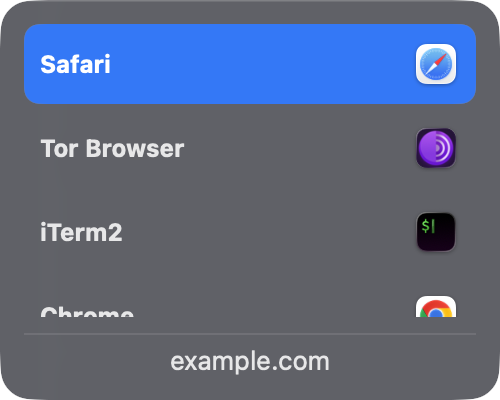
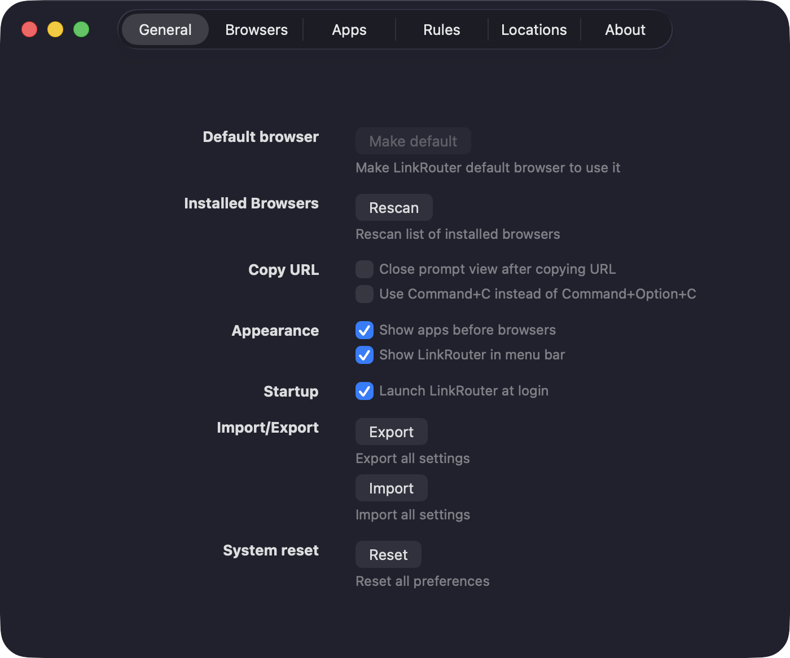

**BrowserSelector** routes every link you click into the right browser. Set it
as the macOS default browser and a picker appears at the cursor; choose with
the mouse, arrow keys, or a per-browser shortcut, or let a rule route it
silently.

Built to keep work in Chrome and everything else in Dia on the same machine.

## Features

- Native SwiftUI — instant popup, tiny footprint, no Electron
- Per-browser keyboard shortcuts
- Regex rules that route matching URLs with no prompt
- Browser profile support
- **Unwraps redirect wrappers** before matching — Outlook SafeLinks, Google
  `/url`, LinkedIn, Facebook, Reddit. Without this, every rule written against
  a real host silently fails on work mail, because the link arrives as
  `*.safelinks.protection.outlook.com`
- **Records the sending app** for each link, so source-based rules ("anything
  from Slack → Chrome") can be designed against real data
- macOS 13+, Apple Silicon and Intel

## In action

| The picker | Preferences |
|:---:|:---:|
|  |  |

## Build and install

Building the `.app` needs **Xcode.app**; Command Line Tools alone is not
enough (no `xcodebuild`, no asset-catalog compiler, no SwiftUI macro plugins).

```bash
xcodebuild -project BrowserSelector.xcodeproj -scheme BrowserSelector -configuration Release build
```

In Xcode, set Signing & Capabilities → Team **None**, Signing Certificate
**Sign to Run Locally**. No Apple Developer Program membership and no
notarization are needed for a build you run yourself.

Then copy the `.app` into `/Applications` or `~/Applications` — **a bundle
outside those locations is silently ignored by LaunchServices** and never
appears as a browser option. Launch it once, then choose it under
**System Settings → Desktop & Dock → Default web browser**.

## Development

```bash
swift test          # 35 tests, no Xcode required
```

The SwiftPM package compiles only the pure logic (rules, host matching, URL
unwrapping) so the suite runs on Command Line Tools alone. Tests use
**swift-testing**, not XCTest — XCTest ships inside Xcode.app.

Two traps worth knowing:

- Every non-source entry under the target path must stay listed in
  `Package.swift`'s `exclude:`, or SwiftPM tries to run `actool` on the asset
  catalog and fails with a confusing decode error.
- `swift test` intermittently fails with
  `plugin for module 'TestingMacros' not found` — measured at roughly one run
  in three, unrelated to whether the build is clean or incremental. It is a
  macro-plugin resolution flake in Command Line Tools, not a real error; just
  re-run. Expected to stop once Xcode is installed and supplies the plugin.

### Recovery

`spike/` holds the harness used to verify default-browser registration. If a
broken build is left as the system default and links stop opening:

```bash
cd spike && swiftc -o setdefault setdefault.swift && ./setdefault "/Applications/Google Chrome.app"
```

Note that `NSWorkspace.setDefaultApplication` reports
`https: The file couldn't be opened.` even when it succeeds — verify with
`urlForApplication(toOpen:)` rather than trusting the error.

## Credits

A personal fork of [**LinkRouter**](https://github.com/indranandjha1993/LinkRouter)
by [Indranand Jha](https://github.com/indranandjha1993), which is itself a fork
of [**Browserino**](https://github.com/AlexStrNik/Browserino) by
[Aleksandr Strizhnev](https://github.com/AlexStrNik) — full credit for the
original design and implementation belongs to him and the Browserino
contributors. If you find this useful, consider
[supporting the original author](https://alexstrnik.gumroad.com/l/browserino).

Browserino was in turn inspired by
[Browserosaurus](https://github.com/will-stone/browserosaurus).

Licensed GPL-3.0, as required by its upstreams.
